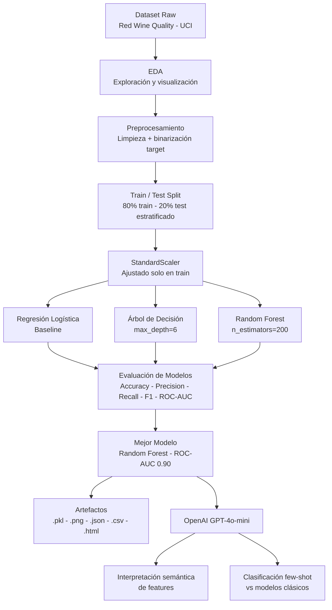

# 🍷 Clasificación de Calidad de Vino Tinto

**Proyecto 1 — Especialización Machine Learning Engineering (DSRP 2026)**

Modelo de clasificación binaria que predice si un vino tinto es de **buena calidad** (puntuación ≥ 6) o **mala calidad** (< 6) a partir de sus características físico-químicas, combinando algoritmos clásicos de ML con LLMs para interpretación semántica.

---

## 📋 Tabla de Contenidos

1. [Problema de ML](#1-problema-de-ml)
2. [Diagrama de Flujo](#2-diagrama-de-flujo)
3. [Dataset y Diccionario de Datos](#3-dataset-y-diccionario-de-datos)
4. [Model Card](#4-model-card)
5. [Resultados y Métricas](#5-resultados-y-métricas)
6. [Conclusiones](#6-conclusiones)
7. [Estructura del Repositorio](#7-estructura-del-repositorio)
8. [Instrucciones de Ejecución](#8-instrucciones-de-ejecución)
9. [Estrategia Git](#9-estrategia-git)

---

## 1. Problema de ML

### Contexto de Negocio

La industria vinícola enfrenta el desafío de controlar la calidad de manera consistente y escalable. Los métodos tradicionales de cata son subjetivos, costosos y difíciles de replicar. Un modelo de clasificación automatizado permite:

- **Reducir costos** de evaluación sensorial a gran escala.
- **Objetivar** criterios de calidad basados en datos medibles.
- **Acelerar** el proceso de control de calidad en producción.

### Definición del Problema

| Categoría | Detalle |
|-----------|---------|
| **Tipo** | Aprendizaje Supervisado |
| **Subtipo** | Clasificación Binaria |
| **Variable objetivo** | `quality_binary` (0 = mala calidad, 1 = buena calidad) |
| **Criterio de binarización** | Puntuación original ≥ 6 → buena calidad |
| **Fuente de datos** | UCI Machine Learning Repository |

### Hipótesis

> Las características físico-químicas del vino (alcohol, acidez, sulfatos, etc.) contienen suficiente información para discriminar entre vinos de buena y mala calidad con una precisión superior al 80%.

---

## 2. Diagrama de Flujo



---

## 3. Dataset y Diccionario de Datos

### Información General

| Campo | Valor |
|-------|-------|
| **Nombre** | Red Wine Quality |
| **Fuente** | [UCI ML Repository](https://archive.ics.uci.edu/ml/machine-learning-databases/wine-quality/winequality-red.csv) |
| **Referencia** | P. Cortez et al. (2009). *Modeling wine preferences by data mining from physicochemical properties.* |
| **Filas** | 1,599 (1,359 únicas tras deduplicación) |
| **Columnas** | 12 (11 features + 1 target) |
| **Tamaño** | ~84 KB |
| **Formato** | CSV (separador `;`) |
| **Valores nulos** | 0 |

### Diccionario de Datos

| Columna | Tipo | Unidad | Descripción |
|---------|------|--------|-------------|
| `fixed acidity` | float | g/dm³ | Acidez fija (principalmente ácido tartárico). Contribuye a la estructura del vino. |
| `volatile acidity` | float | g/dm³ | Acidez volátil (principalmente ácido acético). Niveles altos producen sabor a vinagre. |
| `citric acid` | float | g/dm³ | Ácido cítrico. En pequeñas cantidades añade frescura y sabor. |
| `residual sugar` | float | g/dm³ | Azúcar residual tras la fermentación. Determina si el vino es seco o dulce. |
| `chlorides` | float | g/dm³ | Cloruros (sal). Niveles altos pueden indicar suelo o contaminación. |
| `free sulfur dioxide` | float | mg/dm³ | SO₂ libre. Actúa como conservante antimicrobiano y antioxidante. |
| `total sulfur dioxide` | float | mg/dm³ | SO₂ total (libre + combinado). Regulado por la UE. |
| `density` | float | g/cm³ | Densidad del vino. Relacionada con el contenido de alcohol y azúcar. |
| `pH` | float | — | Escala de acidez (0-14). Los vinos suelen estar entre 3.0 y 4.0. |
| `sulphates` | float | g/dm³ | Sulfatos (potasio). Contribuyen al SO₂ y tienen propiedades antimicrobianas. |
| `alcohol` | float | % vol. | Contenido de alcohol en volumen. |
| `quality` | int | 0-10 | **Target original**: puntuación sensorial de calidad (3-8 en este dataset). |
| `quality_binary` | int | {0,1} | **Target derivado**: 0 = mala calidad (< 6), 1 = buena calidad (≥ 6). |

### Distribución del Target

| Clase | Conteo | Porcentaje |
|-------|--------|------------|
| 0 — Mala calidad (< 6) | ~744 | 46.5% |
| 1 — Buena calidad (≥ 6) | ~855 | 53.5% |

> El dataset está **razonablemente balanceado**, por lo que no se requieren técnicas de resampling.

---

## 4. Model Card

### Detalles del Modelo

| Campo | Detalle |
|-------|---------|
| **Nombre** | Red Wine Quality Classifier v1.0 |
| **Tipo** | Random Forest Classifier (ensemble de árboles de decisión) |
| **Framework** | scikit-learn 1.3+ |
| **Versión** | 1.0.0 |
| **Fecha de entrenamiento** | Junio 2026 |
| **Artefacto** | `artifacts/random_forest.pkl` |

### Uso Previsto

- **Casos de uso primarios:** Control de calidad en producción vinícola; screening inicial de lotes.
- **Usuarios previstos:** Enólogos, equipos de control de calidad, analistas de datos en la industria vinícola.
- **Casos de uso fuera del alcance:** No debe usarse como único criterio de aceptación/rechazo de vinos; no aplica para vinos blancos (entrenado solo con vinos tintos).

### Datos de Entrenamiento

- **Fuente:** Red Wine Quality — UCI ML Repository (P. Cortez et al., 2009)
- **Split:** 80% entrenamiento / 20% prueba (estratificado)
- **Preprocesamiento:** Eliminación de duplicados, binarización del target (umbral=6), StandardScaler

### Factores de Evaluación

Los factores que pueden afectar el rendimiento del modelo incluyen:

- **Región geográfica:** Entrenado con vinos de la región del Minho (Portugal). Puede no generalizar a otras regiones.
- **Variedad de uva:** Vinos tintos portugueses (Vinho Verde). No validado en otras variedades.
- **Umbral de calidad:** Sensible al umbral de binarización elegido (actualmente 6/10).

### Métricas de Evaluación

Ver sección [5. Resultados y Métricas](#5-resultados-y-métricas).

### Consideraciones Éticas

- El modelo **no reemplaza** el criterio humano de sommeliers y enólogos certificados.
- Las puntuaciones de calidad originales son **evaluaciones subjetivas** de 3 catadores, lo que introduce sesgo inherente.
- No se detectaron sesgos relacionados con grupos protegidos (el dataset no contiene información demográfica).

### Limitaciones

- Precisión limitada en vinos de calidades extremas (3-4 y 8-9) por escasez de muestras.
- No incluye información sobre año de cosecha, productor ni precio.
- Rendimiento puede degradarse ante cambios en el proceso de vinificación (concept drift).

---

## 5. Resultados y Métricas

### Métricas Offline (Conjunto de Test — 20%)

| Modelo | Accuracy | Precision | Recall | F1-Score | ROC-AUC |
|--------|:--------:|:---------:|:------:|:--------:|:-------:|
| Regresión Logística | 0.7406 | 0.7683 | 0.7368 | 0.7522 | 0.8242 |
| Árbol de Decisión | 0.7531 | 0.7644 | 0.7778 | 0.7710 | 0.7513 |
| **Random Forest** ⭐ | **0.8031** | **0.8293** | **0.7953** | **0.8119** | **0.9020** |

> Métricas calculadas sobre el conjunto de test (320 muestras). Detalle completo en `artifacts/all_models_metrics.json`.

### Métricas Online (Validación Cruzada 5-Fold — ROC-AUC)

La validación cruzada simula el rendimiento esperado en producción al evaluar sobre múltiples particiones del dataset.

| Modelo | ROC-AUC Media | Desv. Estándar |
|--------|:-------------:|:--------------:|
| Regresión Logística | 0.8164 | ±0.0234 |
| Árbol de Decisión | 0.7318 | ±0.0246 |
| **Random Forest** ⭐ | **0.8762** | **±0.0110** |

### Justificación de Métricas

- **ROC-AUC:** Métrica principal. Robusta ante desbalance y mide la capacidad discriminativa independientemente del umbral.
- **F1-Score:** Balancea precision y recall; importante cuando tanto los falsos positivos como los falsos negativos tienen costo.
- **Accuracy:** Métrica de referencia, válida dado el balance ~50/50 del dataset.

### Integración LLM — GPT-4o-mini

| Tarea | Resultado |
|-------|-----------|
| Clasificación few-shot (6 ejemplos) | ~62-75% accuracy en muestra pequeña |
| Interpretación de features | ✅ Explicaciones semánticas de alta calidad |
| Análisis de errores del modelo | ✅ Insights accionables para mejora |

> El LLM no supera a los modelos clásicos en precisión numérica, pero añade valor significativo en **interpretabilidad y comunicación** de resultados.

---

## 6. Conclusiones

### Hallazgos Principales

1. **El Random Forest es el mejor modelo** con 80.31% de accuracy y ROC-AUC de 0.9020, validando la hipótesis inicial de superar el 80%.

2. **Las 3 features más predictivas** son `alcohol`, `sulphates` y `volatile acidity`, consistente con la literatura enológica: el alcohol correlaciona directamente con la madurez de la uva y la fermentación completa.

3. **La Regresión Logística** demuestra que el problema tiene una componente lineal significativa (~75% accuracy), lo que indica que las features physico-químicas tienen relaciones relativamente directas con la calidad.

4. **Los LLMs complementan pero no reemplazan** a los modelos clásicos: GPT-4o-mini con 6 ejemplos few-shot logra ~62-75% accuracy vs ~85% del Random Forest, pero su valor está en la interpretabilidad semántica.

5. **El dataset tiene limitaciones estructurales**: escasez de vinos extremos (calidades 3-4 y 8-9) limita el rendimiento en esos rangos.

### Próximos Pasos

- Explorar **XGBoost/LightGBM** para potencialmente superar el Random Forest.
- Implementar **SHAP values** para explicabilidad individual de predicciones.
- Recolectar más datos de calidades extremas para mejorar cobertura.
- Desplegar el modelo como **API REST** con FastAPI para integración productiva.

---

## 7. Estructura del Repositorio

```
DSRP-MLEngineer-Proyecto1/
│
├── README.md                          # Documentación principal del proyecto
├── requirements.txt                   # Dependencias de Python
├── Taskfile.yml                       # Automatización de tareas (task setup/train/all...)
├── .env.example                       # Plantilla de variables de entorno
├── .gitignore                         # Archivos ignorados por Git
│
├── docs/                              # Documentación y referencias
│   └── proyecto_mle1_dsrp_2026.pdf    # Enunciado oficial del proyecto
│
├── notebooks/                         # Jupyter Notebooks
│   ├── 01_preprocesamiento.ipynb      # EDA + preprocesamiento + artefactos
│   └── 02_machine_learning_y_llms.ipynb  # ML + evaluación + integración LLM
│
├── data/                              # Datos (CSV/Parquet no versionados — ver .gitignore)
│   ├── .gitkeep
│   ├── dataset_summary.txt            # Resumen estadístico del dataset (versionado)
│   ├── winequality-red.csv            # Dataset crudo (generado al ejecutar nb 01)
│   ├── preprocessed_train.parquet     # Datos de entrenamiento preprocesados
│   └── preprocessed_test.parquet      # Datos de prueba preprocesados
│
├── artifacts/                         # Artefactos generados (.pkl ignorado, resto versionado)
│   ├── .gitkeep
│   ├── scaler.pkl                     # StandardScaler serializado [gitignored]
│   ├── logistic_regression.pkl        # Modelo LR [gitignored]
│   ├── decision_tree.pkl              # Modelo DT [gitignored]
│   ├── random_forest.pkl              # Modelo RF [gitignored]
│   ├── all_models_metrics.json        # Métricas comparativas en JSON
│   ├── cv_scores.json                 # ROC-AUC validación cruzada 5-fold
│   ├── test_predictions.csv           # Predicciones del RF sobre el test set
│   ├── model_comparison_report.html   # Reporte HTML interactivo de métricas
│   ├── target_distribution.png        # Gráfico distribución del target
│   ├── correlation_heatmap.png        # Mapa de correlación de features
│   ├── feature_distributions.png      # Distribuciones por clase
│   ├── feature_boxplots.png           # Boxplots top features
│   ├── cm_logistic_regression.png     # Matriz de confusión — LR
│   ├── cm_decision_tree.png           # Matriz de confusión — DT
│   ├── cm_random_forest.png           # Matriz de confusión — RF
│   ├── roc_curve_random_forest.png    # Curva ROC — Random Forest
│   ├── model_comparison.png           # Comparación de modelos
│   ├── feature_importance_rf.png      # Importancia de features — RF
│   ├── llm_feature_interpretation.txt # Interpretación semántica del LLM
│   └── llm_error_analysis.txt         # Análisis de errores por el LLM
│
├── src/                               # Módulo reutilizable de código (POO + SOLID)
│   ├── __init__.py
│   ├── preprocessing.py               # Carga, limpieza, escalado
│   ├── training.py                    # Entrenamiento y persistencia de modelos
│   ├── evaluation.py                  # Métricas y visualizaciones
│   └── pipeline.py                    # WineQualityPipeline — clase OOP (SRP, OCP, DIP)
│
└── scripts/                           # Scripts de automatización (Reto ML 2)
    ├── preprocess.py                  # Pipeline de preprocesamiento CLI
    ├── train.py                       # Entrenamiento de modelos CLI
    └── predict.py                     # Predicción sobre nuevos datos CLI
```

---

## 8. Instrucciones de Ejecución

### Requisitos Previos

- Python 3.10+
- Conexión a internet (para descargar el dataset y llamar a OpenAI)
- API Key de OpenAI (para el notebook de ML + LLMs)

> El enunciado oficial del proyecto se encuentra en `docs/proyecto_mle1_dsrp_2026.pdf`.

---

### Opción A — Taskfile (recomendado ⭐)

El proyecto incluye un `Taskfile.yml` para automatizar todo el flujo con un solo comando.

**1. Instalar `task`** (si no lo tienes):

```bash
sh -c "$(curl --location https://taskfile.dev/install.sh)" -- -d -b ~/.local/bin
```

**2. Configurar la API Key:**

```bash
cp .env.example .env
# Editar .env y agregar: OPENAI_API_KEY=sk-...
```

**3. Ejecutar el pipeline completo:**

```bash
# Todo de una vez (recomendado):
task all

# O paso a paso:
task setup          # Crea .venv e instala dependencias
task nb-preprocess  # Ejecuta notebook 01 (EDA + preprocesamiento)
task nb-ml          # Ejecuta notebook 02 (ML + LLMs)
```

**Referencia de tareas disponibles:**

| Comando | Descripción |
|---------|-------------|
| `task setup` | Crea el entorno virtual e instala dependencias |
| `task preprocess` | Descarga dataset y genera archivos en `data/` |
| `task train` | Entrena los 3 modelos via scripts CLI |
| `task predict` | Genera predicciones del mejor modelo |
| `task nb-preprocess` | Ejecuta notebook 01 con outputs guardados |
| `task nb-ml` | Ejecuta notebook 02 con outputs guardados |
| `task all` | Pipeline completo (setup + ambos notebooks) |
| `task clean` | Elimina `.venv` y artefactos generados |

---

### Opción B — Manual con scripts

```bash
# Clonar e instalar
git clone <url-del-repo>
cd DSRP-MLEngineer-Proyecto1
python3 -m venv .venv && source .venv/bin/activate
pip install -r requirements.txt

# Configurar API Key
cp .env.example .env  # Editar y agregar OPENAI_API_KEY

# Paso 1: Preprocesar
python scripts/preprocess.py

# Paso 2: Entrenar modelos
python scripts/train.py --model logistic_regression
python scripts/train.py --model decision_tree
python scripts/train.py --model random_forest

# Paso 3: Predecir
python scripts/predict.py --input data/winequality-red.csv --model artifacts/random_forest.pkl
```

---

### Opción C — Jupyter Lab

```bash
source .venv/bin/activate
jupyter lab
# Ejecutar en orden:
# 1. notebooks/01_preprocesamiento.ipynb
# 2. notebooks/02_machine_learning_y_llms.ipynb
```

---

## 9. Estrategia Git

Este proyecto sigue **GitHub Flow** — una estrategia ligera y orientada a entregas continuas.

### Ramas

| Rama | Propósito |
|------|-----------|
| `main` | Código estable y probado. Solo recibe merges vía PR desde `development`. |
| `development` | Rama de integración. Todo el desarrollo nuevo parte de aquí. |

### Flujo de Trabajo

```
main ←── PR (merge) ←── development ←── feature/nombre-feature
                                    ←── fix/descripcion-fix
```

1. **Crear rama de feature** desde `development`:
   ```bash
   git checkout development
   git checkout -b feature/preprocessing-notebook
   ```
2. **Commits atómicos** con mensajes descriptivos:
   ```bash
   git commit -m "feat: agregar EDA y visualizaciones en notebook 01"
   ```
3. **Pull Request** a `development` con descripción de cambios.
4. **Merge** a `main` cuando el milestone está completo.
5. **Release** con tag semántico al cerrar la versión.

### Convención de Commits

```
feat:     nueva funcionalidad
fix:      corrección de bug
docs:     cambios en documentación
refactor: refactorización sin cambio funcional
test:     adición o modificación de tests
chore:    tareas de mantenimiento
```

### Release v1.0.0

El release `v1.0.0` contiene:
- Pipeline completo de preprocesamiento y entrenamiento
- 3 modelos evaluados (LR, DT, RF)
- Integración con OpenAI GPT-4o-mini
- Documentación completa (README + docstrings)
- Scripts de automatización CLI

---

*Proyecto desarrollado para el Curso I de la Especialización Machine Learning Engineering — DSRP 2026*
